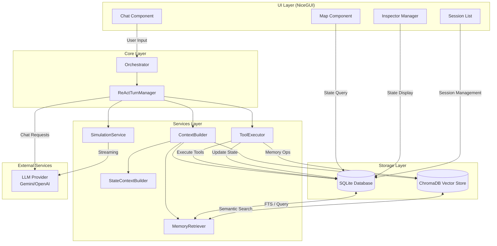
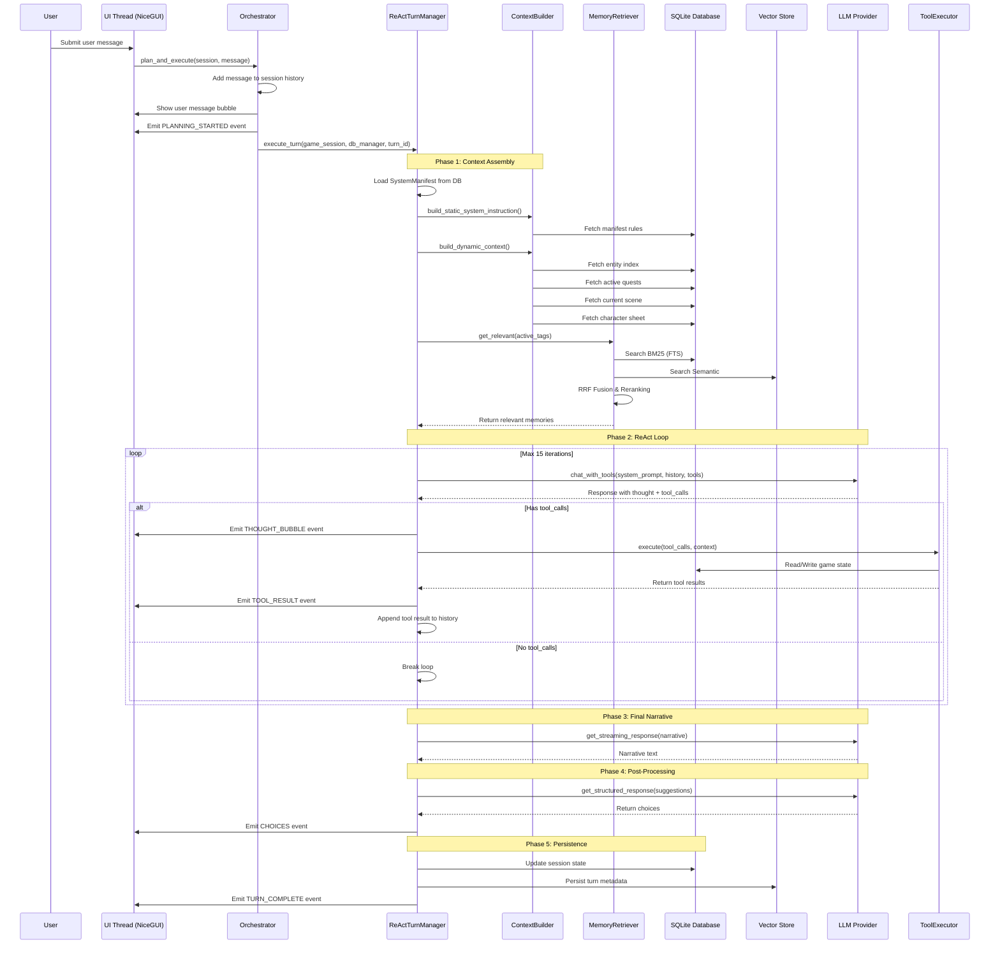
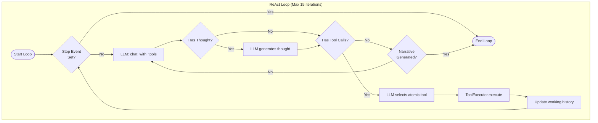
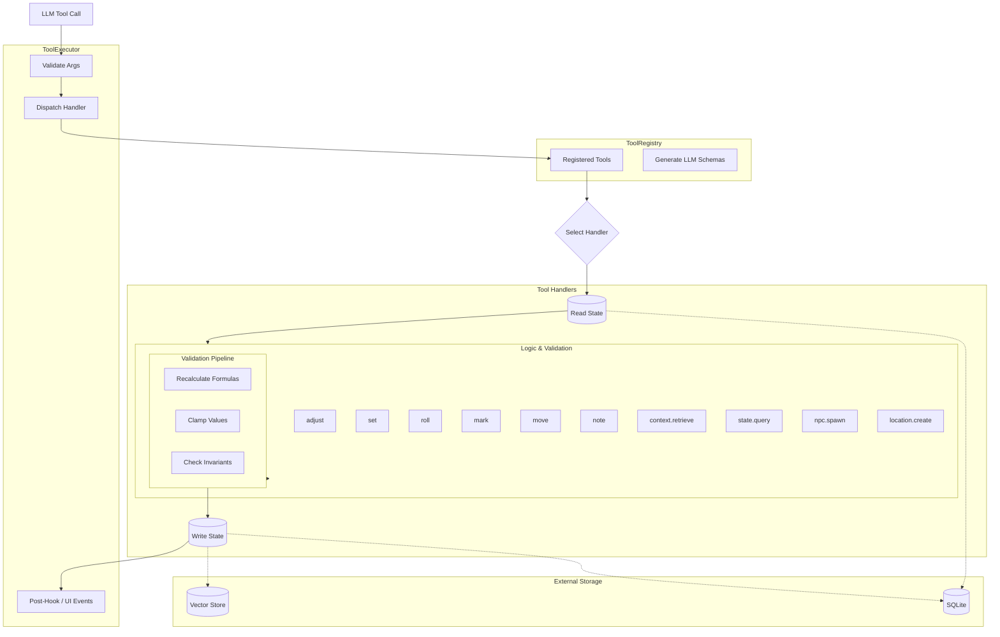
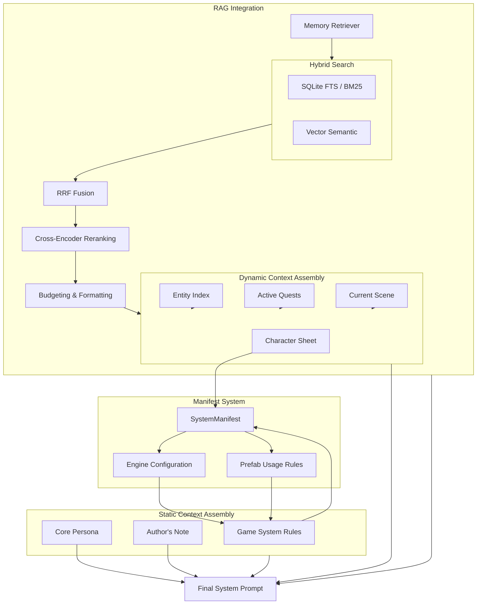
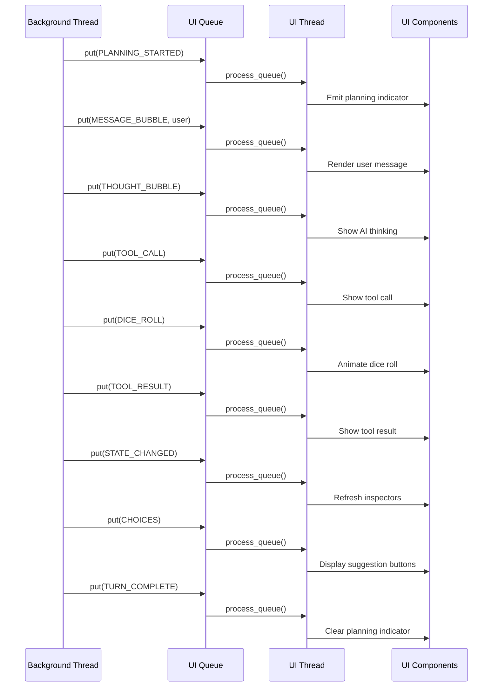
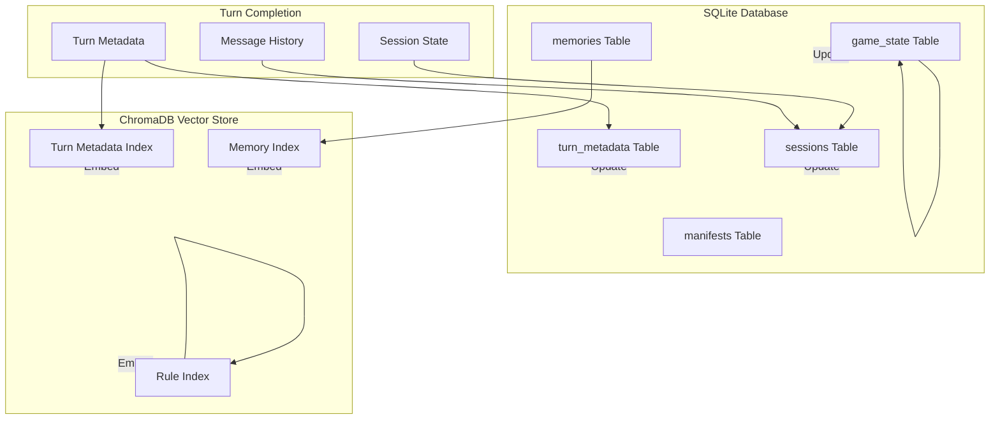
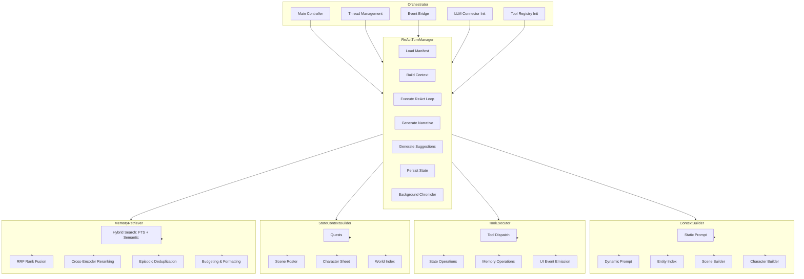

# AI-RPG Architecture Flows

This document contains Mermaid diagrams illustrating the main application flows of the AI-RPG system.

## System Overview

## Turn Execution Flow

## ReAct Loop Detail

## Tool Execution Flow

## Context Building Flow

## UI Event Flow

## Data Persistence Flow

## Component Responsibilities

