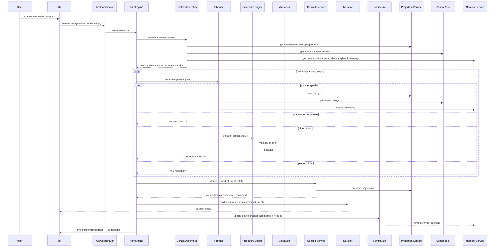
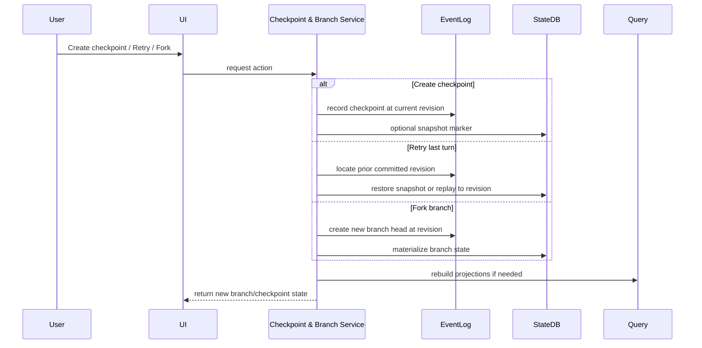

# AI-RPG v2.2 Architecture Rewrite
**Manifest-driven game runtime with lorebook, branching, director console, projections, and package system**

---

# 1. Product definition

## Revised product statement

**AI-RPG is a compiled, manifest-driven narrative game runtime.**  
A system manifest defines entities, fields, invariants, procedures, UI views, and package bindings. At runtime, an LLM interprets player intent, queries structured state/lore/memory views, selects deterministic procedures, and narrates outcomes. The engine executes against draft state, validates invariants, commits event batches atomically, and then renders narrative and UI updates from committed truth.

## New design additions inspired by Aventuras and Talemate
This version adds:

- a **Canon Book / Lorebook** layer
- **chapter/arc memory** on top of event logs
- **checkpoints, retries, forks, and timeline browsing**
- a **Director Console** for GM/admin/debug actions
- **projection-first world-state UI**
- **shared campaign context** across scenes
- **packageable scenes/procedures/assets**
- **per-role model routing**
- **local-first export/sync-friendly architecture**

These additions map well to your goals without weakening your state-first design. 

---

# 2. Core principles

1. **Canonical truth lives in state + event log, not prose.**
2. **The LLM chooses procedures, not arbitrary DB mutations.**
3. **Lore is authorable and retrievable, but distinct from state.**
4. **Every turn is transactional, replayable, and forkable.**
5. **Narrative follows mechanics.**
6. **UI reads projections, not raw tables.**
7. **Campaigns are packageable and portable.**
8. **Watchers/pins/summaries help context, but do not override canonical state.**

---

# 3. New top-level architecture

```mermaid
graph TB
    subgraph Authoring["Authoring Layer"]
        RulesText[Rules Text / Preset]
        Extractor[Manifest Extractor AI]
        ManifestEditor[Manifest Editor]
        LoreEditor[Canon Book Editor]
        ProcStudio[Procedure Studio]
        Compiler[Manifest Compiler]
        TestRunner[Fixture Test Runner]
        Packager[Package Builder]
        RuntimePkg[Compiled Runtime Package]
    end

    subgraph Runtime["Runtime Layer"]
        UI[UI / API]
        App[AppCoordinator]
        Turn[TurnEngine]
        Context[ContextAssembler]
        Planner[Planner LLM]
        Proc[Procedure Engine]
        Validate[Validation Engine]
        Commit[Commit Service]
        Narrator[Narrative Renderer]
        Suggest[Suggestion Renderer]
        Summarizer[Arc/Chapter Summarizer]
        Director[Director Console]
        Query[Projection Service]
        Canon[Canon Book Service]
        Memory[Memory Service]
        Branch[Checkpoint & Branch Service]
        Shared[Shared Context Service]
        Sync[Export / Sync Service]
        Pins[Context Pin Service]
        Events[UI Event Bus]
    end

    subgraph Storage["Storage"]
        ManifestStore[(Manifest Store)]
        PackageStore[(Package Store)]
        StateDB[(SQLite Canonical State)]
        EventLog[(Turn Event Log)]
        Checkpoints[(Checkpoint / Branch Store)]
        Projections[(Read Models)]
        CanonStore[(Canon Book Store)]
        Vector[(Vector Store)]
        Assets[(Asset Store)]
    end

    RulesText --> Extractor --> ManifestEditor
    ManifestEditor --> Compiler
    LoreEditor --> CanonStore
    ProcStudio --> Compiler
    Compiler --> TestRunner --> Packager --> RuntimePkg
    RuntimePkg --> ManifestStore
    RuntimePkg --> PackageStore

    UI --> App --> Turn
    UI --> Query
    UI --> Director

    Turn --> Context
    Turn --> Planner
    Planner --> Proc
    Proc --> Validate
    Validate --> Commit
    Commit --> StateDB
    Commit --> EventLog
    Commit --> Checkpoints
    Commit --> Projections
    Commit --> Events

    Turn --> Narrator
    Turn --> Suggest
    Turn --> Summarizer

    Context --> Query
    Context --> Canon
    Context --> Memory
    Context --> Shared
    Context --> Pins
    Memory --> Vector
    Canon --> CanonStore
    Query --> Projections
    Branch --> Checkpoints
    Sync --> PackageStore
    Sync --> Assets
```

---

# 4. New major subsystems

## 4.1 Canon Book Service
This is the **Aventuras-inspired lorebook**, adapted for a formal runtime.

Aventuras’s lorebook supports unified entries for characters, locations, items, factions, concepts, and events; aliases; hidden info; dynamic state tracking; and import/export. 

## In your engine, the Canon Book should be:
- **authorable**
- **versioned**
- **entity-linked**
- **visibility-aware**
- **separate from canonical state**

### Canon Book entry types
- character canon
- location canon
- faction canon
- item canon
- concept canon
- event canon
- rumor/secret canon
- style/tone canon

### Entry visibility tiers
- `public`
- `gm_only`
- `system_only`

### Entry features
- aliases
- tags
- entity links
- scene links
- branch scoping
- import/export
- provenance
- stale/conflict markers

### Important rule
If something is mechanically true **now**, it belongs in state.  
If something is a background/world fact, it belongs in canon.

---

## 4.2 Chapter / Arc Summarizer
Aventuras emphasizes chapter summarization, metadata, and long-arc memory; Talemate also has a summarizer role and explicit time-jump summarization behavior. 

So add a dedicated summarization layer:

### Memory layers
1. **turn event log** — canonical replay history
2. **scene summary** — current-scene recap
3. **chapter summary** — bounded span of turns
4. **arc summary** — major storyline progression
5. **campaign recap** — long-horizon continuity

### Chapter summary metadata
- involved entities
- locations
- quest threads
- unresolved hooks
- time advanced
- important state transitions
- emotional tone
- suggested recap title

### Why this matters
This gives you:
- better retrieval
- cleaner save/load UX
- better recap UI
- lower prompt cost
- better branch diffs

---

## 4.3 Checkpoint & Branch Service
Aventuras has named checkpoints and retry; Talemate adds changelog-based restoration and true forking. 

This should become a first-class subsystem.

### Objects
- `checkpoint`
- `branch`
- `timeline`
- `revision`
- `retry`

### Capabilities
- create named checkpoint
- retry from latest checkpoint
- fork from any committed turn
- restore to any revision
- compare branches
- mark alternate timeline as canonical
- branch-local canon/state overrides

### Storage model
- event batches are immutable
- periodic snapshots
- inverse patches for fast undo
- branch heads reference event offsets or snapshot IDs

---

## 4.4 Director Console
Talemate’s director chat is one of the most useful ideas to borrow. It exposes a dedicated conversational/admin control surface for scene queries and state changes. 

For your app, the Director Console should be a **human/admin/GM tool**, not the player-facing planner.

### Director Console uses
- inspect state
- inspect rule contracts
- explain why a turn resolved a certain way
- run admin procedures
- fix broken entities
- review event batches
- inspect validation failures
- create branch/checkpoint
- hot-edit canon entries
- simulate procedure on draft state
- review summaries and memory candidates

### Director Console modes
- `query`
- `admin_edit`
- `replay`
- `debug`
- `authoring_assist`

### Important rule
Director changes should still go through:
- procedure engine
- validation engine
- commit service

No magical bypasses.

---

## 4.5 Projection-based World State
Talemate’s world-state view is a very good UI pattern: current scene snapshot, characters/objects, expandable details, and action shortcuts. 

You should formalize this as **projection service**, not ad hoc inspectors.

### Core projections
- `scene_snapshot`
- `roster_snapshot`
- `object_snapshot`
- `character_sheet`
- `inventory_projection`
- `quest_projection`
- `relationship_projection`
- `active_threats`
- `clock_and_pressure`
- `recent_changes`

### UX goals
- current scene at a glance
- expandable entities
- “why changed?” links to event log
- pending quest pressure
- time state
- branch indicator
- recent procedure outcomes

---

## 4.6 Shared Context Service
Talemate’s shared world context across scenes is very worth adapting. 

In your engine:

### Shared context scopes
- `campaign_global`
- `chapter_shared`
- `scene_local`
- `branch_local`

### Shareable assets
- canon entries
- factions
- player party
- recurring NPCs
- rules clarifications
- reference locations
- persistent relationship graphs

### Non-shareable by default
- temporary scene objects
- branch-specific outcomes
- scratch notes
- draft state

---

## 4.7 Context Pin Service
Talemate explicitly supports pinned information and later added pin decay. 

This is a good fit if you implement it safely.

### Pin types
- `manual_pin`
- `system_pin`
- `quest_pin`
- `scene_pin`
- `rule_pin`

### Pin features
- priority
- TTL / decay
- branch scope
- refresh condition
- source reference
- visibility

### Example
- “The ritual circle is unstable”
- “Player is disguised as a guard”
- “Nonlethal intent requested”
- “Quest thread: missing magistrate”

These help prompt assembly without polluting canon or state.

---

# 5. Updated tool architecture

## 5.1 LLM-facing tools
The planner should use a **small explicit surface**.

### Query tools
- `get_view`
- `get_canon_entry`
- `search_memory`
- `inspect_rule`

### Action tool
- `execute_procedure`

### Optional
- `request_clarification`

## Why add `get_canon_entry`
Because lorebook/canon is now a first-class subsystem, separate from:
- current state
- event history
- memory summaries

This matches the lorebook value Aventuras gets from unified entries, aliases, and hidden data. 

---

## 5.2 Internal engine opcodes
Still internal, not primary planner tools:

- `roll_dice`
- `set_field`
- `adjust_value`
- `move_entity`
- `set_flag`
- `create_entity`
- `link_entities`
- `append_event_note`
- `advance_clock`
- `attach_tag`
- `detach_tag`

---

## 5.3 Director-only admin tools
Not exposed to normal runtime planner:

- `admin_patch_state`
- `rebuild_projection`
- `reindex_memory`
- `recompute_derived_fields`
- `create_checkpoint`
- `fork_branch`
- `restore_revision`
- `publish_canon_change`
- `run_fixture_test`

---

# 6. Procedure architecture

## 6.1 Procedure-first runtime
Keep procedures as the main unit of game action.

### Procedure categories
- combat
- social
- exploration
- quest
- travel
- time
- world-authoring
- inventory/resource
- clue/revelation
- relationship

## 6.2 Add “time” procedures
Talemate’s scene tools explicitly include advancing time, and time jumps trigger state updates/summarization. 

So add:
- `time.advance_minutes`
- `time.advance_hours`
- `time.advance_days`
- `time.jump_to_scene`

These should:
- update draft clock
- trigger due timers
- schedule summary boundaries
- update time-sensitive projections

---

## 6.3 Procedure Packs
Talemate’s node editor, reusable modules, and installable scene packages suggest a strong mod/plugin direction. 

I would adapt that as **Procedure Packs**, not a full freeform node editor at first.

### Procedure Pack contents
- compiled procedures
- prefab bindings
- test fixtures
- UI descriptors
- optional assets
- canon templates
- migration/version metadata

### Pack types
- `system_pack`
- `campaign_pack`
- `scene_pack`
- `procedure_pack`
- `asset_pack`

### Why this is better than copying a node editor immediately
- more testable
- more stable
- easier to diff/version
- fits your manifest compiler model better

---

# 7. Updated turn flow

---

# 8. New checkpoint / branch flow

---

# 9. Memory rewrite

## 9.1 Memory lanes
Now explicitly separate:

### Canonical
- state DB
- event log

### Retrieval-oriented
- episodic memory
- lore/canon
- chapter summaries
- arc summaries
- unresolved hooks

### Temporary
- context pins
- scratch notes
- draft-only rationale

---

## 9.2 Memory write policy
Instead of generic `note` persistence:

- procedures emit structured events
- commit service creates memory candidates
- summarizer compresses events into chapter/arc memory
- canon updates require separate approval/publication flow

This is cleaner than a freeform memory write tool.

---

# 10. Watchers instead of tracked truth

Talemate’s tracked states are useful UX-wise, but their docs warn they can degrade after a bad generation. 

So in your system, create:

## `Watcher` objects
Watchers are **non-canonical annotations** over state/history.

### Watcher types
- `derived_watcher` — deterministic formula-based
- `heuristic_watcher` — AI-assisted annotation
- `gm_watcher` — manually curated
- `alert_watcher` — rule threshold or timer warning

### Examples
- “Scene tension: rising”
- “Guard suspicion: moderate”
- “Weather trend: worsening”
- “Morale: unstable”

### Rule
A watcher may inform prompts and UI, but it cannot directly mutate canonical mechanics unless converted into a validated procedure result.

---

# 11. Projection UX rewrite

Talemate’s world-state snapshot and action shortcuts are a good UX reference. 

## Recommended UI panes

### Left panel
- scene snapshot
- current branch
- active quest pressure
- clock/time
- recent changes

### Inspector
- entity details
- canon references
- event history
- watcher list
- related procedures

### Timeline
- turns
- checkpoints
- forks
- chapter boundaries
- restore points

### Director Console
- admin actions
- rule inspection
- replay/debug
- fixture testing

---

# 12. Package system

Talemate supports complete scene packages with nodes/assets/info files, and installable modules. Aventuras supports import/export for lorebook formats. 

Your package architecture should formalize this.

## Package types

### `system_package`
- manifest
- runtime package
- procedure packs
- tests
- UI schemas

### `campaign_package`
- campaign canon
- shared context
- branch metadata
- assets
- chapter summaries

### `scene_package`
- scene-local state seed
- scene canon overlay
- assets
- entry script
- optional scene procedures

### `lore_package`
- canon entries
- aliases
- secrecy flags
- import mappings

---

# 13. Provider architecture

Talemate explicitly supports per-agent API selection.   
That matches your separation of Planner, Narrator, Summarizer, and Extractor.

## Add per-role model routing
- Planner: best structured-output model
- Narrator: best style model
- Summarizer: cheap long-context model
- Extractor: strongest schema/analysis model
- Embeddings: separate model

## Add capability matrix
Each provider/model gets flags for:
- strict schema reliability
- tool-call reliability
- streaming quality
- long-context/caching support
- JSON repair needs
- latency/cost profile

This lets users swap models without pretending all models behave equally well.

---

# 14. Local-first and sync architecture

Aventuras explicitly markets local-first/privacy and local sync between devices. 

That philosophy fits your app very well.

## Recommended posture
- canonical campaign data remains portable
- export/import is first-class
- LAN sync optional
- cloud sync optional later
- no hard server dependency

## Sync units
- system package
- campaign package
- scene package
- branch export
- lore package

## Why this matters
Long-running RPG campaigns benefit from:
- ownership
- portability
- backups
- easy branch sharing
- offline resilience

---

# 15. Suggested component list

## Authoring layer
- `ManifestExtractorService`
- `ManifestCompiler`
- `ProcedureStudio`
- `CanonBookEditorService`
- `PackageBuilder`
- `FixtureTestRunner`

## Runtime layer
- `AppCoordinator`
- `TurnEngine`
- `ContextAssembler`
- `ProcedureEngine`
- `ValidationEngine`
- `CommitService`
- `ProjectionService`
- `CanonBookService`
- `MemoryService`
- `ChapterSummarizer`
- `BranchService`
- `ContextPinService`
- `DirectorConsoleService`
- `SuggestionRenderer`
- `NarrativeRenderer`

## Provider layer
- `PlannerModelAdapter`
- `NarratorModelAdapter`
- `SummarizerModelAdapter`
- `ExtractorModelAdapter`
- `EmbeddingAdapter`

## Storage layer
- `StateRepository`
- `EventRepository`
- `ProjectionRepository`
- `CheckpointRepository`
- `CanonRepository`
- `PackageRepository`
- `AssetRepository`

---

# 16. What to remove or demote from the previous rewrite

## Remove / demote
- public raw `set` / `adjust` / `mark` tools
- direct UI -> SQLite reads
- “tracked state” as truth
- single undifferentiated memory bucket
- freeform scene-only storage without branch/revision model

## Add / promote
- canon book
- branch/checkpoint store
- projection service
- chapter summarizer
- director console
- procedure packs
- shared context service
- context pins with TTL
- export/sync layer

---

# 17. Recommended implementation order

## Phase 1
- transactional turn draft
- event log
- projection service
- `execute_procedure` runtime

## Phase 2
- canon book
- `get_canon_entry`
- chapter/arc summarizer
- context pins

## Phase 3
- checkpoints/retry/forks
- branch browser
- diff viewer

## Phase 4
- director console
- admin procedures
- replay/debug tooling

## Phase 5
- package system
- system/campaign/scene/lore packages
- shared context

## Phase 6
- per-role model routing
- local sync/export UX
- style-aware suggestions

---

# 18. Final architecture statement

Here’s the updated one-paragraph version I’d put in your docs:

> **AI-RPG is a compiled, manifest-driven narrative game runtime with first-class canon, branching, and projections.** A system manifest is compiled into a runtime package containing entity schemas, invariants, procedures, UI views, and retrieval hints. At runtime, an LLM planner interprets player intent, queries structured views of state, canon, and memory, and selects deterministic procedures. Those procedures execute against draft state, pass through validation, and commit atomically as event batches. A narrator then renders prose from committed facts, while summarizers maintain scene/chapter/arc continuity. Campaigns support checkpoints, forks, shared world context, importable packages, and a Director Console for admin/debug/GM control.

---

# 19. My short recommendation

If you only implement **five** of these imported ideas soon, I’d choose:

1. **Canon Book / Lorebook**
2. **Checkpoint + fork timeline**
3. **Projection-first world-state UI**
4. **Director Console**
5. **Chapter/arc summarizer**

Those five give you the most leverage.
