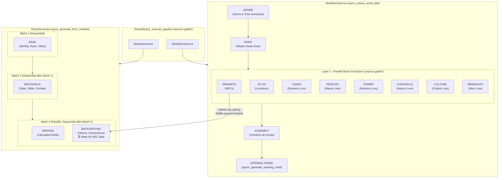

# Session Zero Generation Pipeline

The two top-level pipelines (`WorldGenService` and `SheetGenerator`) run in **parallel** via `asyncio.gather` in the `SetupWizard`. They coordinate via the `LoreStream` object passed to both.

## Key Design Notes

| Concept | Detail |
|---|---|
| **Top-level parallelism** | World gen and Char gen run concurrently via `asyncio.gather` in the wizard |
| **World gen: Layer 0 & 1** | Genre extraction and the Deep Scan/Index run **sequentially** — the index depends on the genre context |
| **World gen: Layer 2** | All category batches (Locations, NPCs, Lore variants) run **in parallel** via `asyncio.gather` |
| **NPC fulfillment** | As soon as the NPC batch result arrives (before all of Layer 2 finishes), `stream.set_npcs()` is called to unblock chargen |
| **Chargen batches** | Batches are sequential (each waits for the previous), but branches *within* a batch run in parallel |
| **Background branch** | Waits on `await stream.get_npcs()` — an `asyncio.Future` that yields the loop until fulfilled |
| **Error propagation** | If world gen fails, `stream.set_error(e)` is called, which causes the `Background` branch to raise immediately rather than hang |
